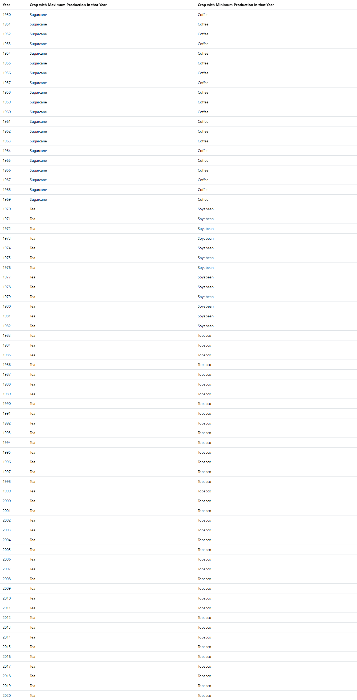
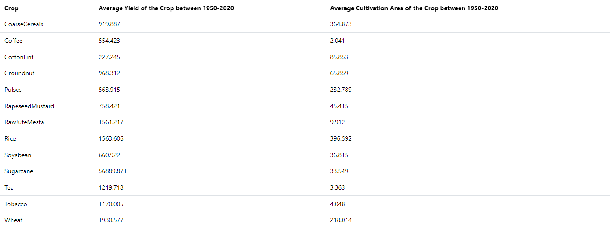

# Indian Agriculture Analytics Dashboard

## Project Overview

This project performs analytics on the Indian Agriculture dataset from the National Data and Analytics Platform (NITI Aayog), presenting insights through interactive tables.

## Project Features

-   Data analytics on Indian agriculture dataset
-   Responsive tables using Mantine v7
-   No external helper libraries
-   Easy local development setup

## Prerequisites

-   Node.js (v16+)
-   Yarn package manager

## Technologies Used

-   React
-   TypeScript
-   Mantine v7
-   [NITI Aayog Agriculture Dataset](https://ndap.niti.gov.in/info?tab=about)

## Installation

1. Clone the repository:

```bash
git clone https://github.com/adityanithariya/manufac.git
cd manufac
```

2. Install dependencies:

```bash
yarn install
```

3. Run the development server:

```bash
yarn dev
```

## Project Screenshots

### Crop Production Table



### Agricultural Land Use Table



## Key Analytics Features

-   Comprehensive data visualization
-   Zero handling for missing values
-   Interactive table interfaces
-   Performance-optimized rendering

## Data Source

[National Data and Analytics Platform](https://drive.google.com/file/d/1p1UW__9DvRuscA01kUFTMz_CUMKvTbyM/view?usp=sharing), [NITI Aayog](https://ndap.niti.gov.in/info?tab=about)

## License

MIT License

## Contributing

1. Fork the repository
2. Create your feature branch (`git checkout -b feature/AmazingFeature`)
3. Commit your changes (`git commit -m 'Add some AmazingFeature'`)
4. Push to the branch (`git push origin feature/AmazingFeature`)
5. Open a Pull Request
